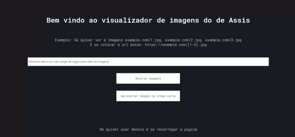

# Bem vindo ao visualizador de imagens do de Assis!
[![Contributors][contributors-shield]][contributors-url]
[![Forks][forks-shield]][forks-url]
[![Stargazers][stars-shield]][stars-url]
[![Issues][issues-shield]][issues-url]
[![MIT License][license-shield]][license-url]
[![LinkedIn][linkedin-shield]][linkedin-url]

 
  <h3 align="center">Melhor visualizador de imagens</h3>

  

  

    Visualize varias fotos de uma URL, fácil e rápido
     
    <a href="https://github.com/Diassisfilho/visualizador-de-imagens"><strong>Explore the docs »</strong></a>
     
     
    <a href="https://diassisfilho.github.io/visualizador-de-imagens/">Acess now</a>
    ·
    <a href="https://github.com/Diassisfilho/visualizador-de-imagens/issues">Report Bug</a>
    ·
    <a href="https://github.com/Diassisfilho/visualizador-de-imagens/issues">Request Feature</a>
  

Este é um visualizador de imagens **WEB** Somente para mais de uma **imagem via URL**. Sua principal funcionalidade é exibir um **conjunto de imagens em ordem numérica**, exemplo:
example.com/1.jpg, example.com/2.jpg, example.com/3.jpg.
Para fazer isto sem ter que digitar todas as URL é só usar o regex que o software livre curl usa para fazer isto, exemplo:
https://example.com/[1-3].jpg
No curl isto junto ao parâmetro `-O` iria baixar todas essas imagens.
## Como usar?
Nesse visualizador **para usar** é só **colocar no campo de texto a URL modificada** e **clicar no botão de mostrar imagens** para mostrar as imagens em um grid, se quiser **ver em ordem as imagens** é só **clicar no botão "Apresentar imagens na ordem certa"**

## Funcionalidades
- **Range regex**:
	- example.com/1.jpg, example.com/2.jpg, example.com/3.jpg igual á  example.com/[1-3].jpg
- **Range regex** com **zeros a esquerda:**
	- example.com/03.jpg ... example.com/12.jpg igual á example.com/[03-12].jpg
	- example.com/0092.jpg ... example.com/0120.jpg igual á  example.com/[0092-0120].jpg
- Mesmo já clicando em "mostrar imagens" se **pode** colocar algum(a) outro/**continuação range no capo de texto** que ira **ser adicionado as novas imagens  abaixo as imagens já adicionada no grid anteriormente**.

- Visualizado de imagens com **modo apresentação, rotacionar, dar zoom in/out e outras coisas.**

- **URLs** das imagens grid no **console do navegador**.

## Tecs usadas

 - **HTML5**
 - **CSS3**
	 - *Google fonts*
- **Javascript**
	- *ViewerJS (Visualizador de imagens js. [git repo]*(https://github.com/webodf/ViewerJS) )
- **Github**
	- *Github pages*
	- *Git projects*

## Coisas a fazer
Consulte a aba de projetcs do github

## Limitações	

- Não é possível usar todas as funções de regex do curl referente a URL, exemplo do que não pode ser feito ( Dentre outras ):
https://example.com/[1-10:1].jpg  (Ir da imagem 1 a 10 pulando de um em um)
- Também não é possível clicar em uma imagem no grid e ir para a imagem sucessora ou antecessora na ordem numérica correta (por causa da implementação JS ).
- Não é possível apagar as imagens do grid (somente recarregando a pagina)

[contributors-shield]: https://img.shields.io/github/contributors/diassisfilho/visualizador-de-imagens.svg?style=for-the-badge
[contributors-url]: https://github.com/diassisfilho/visualizador-de-imagens/graphs/contributors
[forks-shield]: https://img.shields.io/github/forks/diassisfilho/visualizador-de-imagens.svg?style=for-the-badge
[forks-url]: https://github.com/diassisfilho/visualizador-de-imagens/network/members
[stars-shield]: https://img.shields.io/github/stars/diassisfilho/visualizador-de-imagens.svg?style=for-the-badge
[stars-url]: https://github.com/diassisfilho/visualizador-de-imagens/stargazers
[issues-shield]: https://img.shields.io/github/issues/diassisfilho/visualizador-de-imagens.svg?style=for-the-badge
[issues-url]: https://github.com/diassisfilho/visualizador-de-imagens/issues
[license-shield]: https://img.shields.io/github/license/diassisfilho/visualizador-de-imagens.svg?style=for-the-badge
[license-url]: https://github.com/diassisfilho/visualizador-de-imagens/blob/master/LICENSE.txt
[linkedin-shield]: https://img.shields.io/badge/-LinkedIn-black.svg?style=for-the-badge&logo=linkedin&colorB=555
[linkedin-url]: https://www.linkedin.com/in/de-assis-filho-88ba651a3
